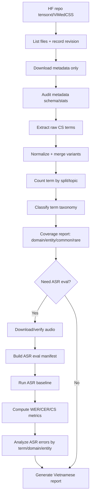
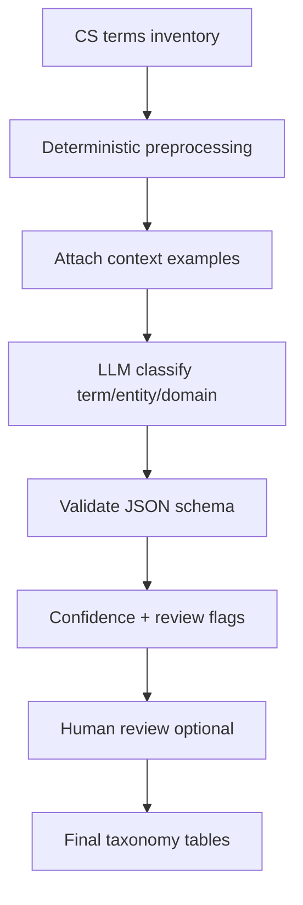

# Requirements cho Coding Agent — ViMedCSS Term Coverage & ASR Code-Switching Evaluation Pipeline

**Phiên bản:** v2.0 — requirements-first  
**Ngày:** 2026-06-16  
**Dataset chính:** `tensorxt/ViMedCSS`  
**Mục tiêu sử dụng:** đưa cho coding agent để xây pipeline tải dataset, kiểm chứng dữ liệu, phân tích coverage medical terms, chạy ASR baseline, đánh giá lỗi ASR trên code-switching Anh/Việt, và xuất report tiếng Việt có số liệu trung thực.

---

## 0. Nguyên tắc bắt buộc

Pipeline này phục vụ nghiên cứu. Coding agent phải ưu tiên **tính đúng, truy vết được nguồn, và không bịa số liệu** hơn tốc độ hoặc giao diện đẹp.

Các rule bắt buộc:

1. **Không tự tạo số liệu.** Mọi con số trong report phải lấy từ một trong các nguồn sau:
   - metadata local đã tải về;
   - audio local đã kiểm chứng;
   - kết quả ASR/evaluation script chạy thực tế;
   - paper/dataset card có ghi rõ URL nguồn;
   - output LLM có lưu đầy đủ input, prompt version, model, timestamp, confidence, và trạng thái review.
2. **Tách rõ `paper_reported`, `hf_reported`, `local_verified`, `llm_inferred`.** Không được trộn các nhóm này thành một kết luận chắc chắn nếu chưa kiểm chứng.
3. **Không coi output LLM là ground truth.** LLM chỉ được dùng để hỗ trợ phân loại term/domain/entity. Kết quả LLM phải có confidence, evidence, và flag `needs_human_review`.
4. **Không over-engineer.** File này là requirements. Coding agent không cần hard-code hướng dẫn cài OS/dependencies vì máy chạy thực tế có thể khác nhau.
5. **Report cuối phải là tiếng Việt.** Các thuật ngữ kỹ thuật có thể giữ tiếng Anh, nhưng phải giải thích rõ.
6. **Mọi pipeline phải chạy được ở chế độ subset/smoke test trước khi chạy full dataset.**
7. **Mọi artifact quan trọng phải lưu thành file.** Không chỉ in ra terminal.

---

## 1. Câu hỏi nghiên cứu cần trả lời

Pipeline không chỉ tải dataset và tính WER. Mục tiêu chính là trả lời các câu hỏi sau:

### 1.1 ViMedCSS đang cover những medical terms nào?

Cần phân tích trước:

```text
ViMedCSS đang có khoảng 8xx distinct code-switching medical terms theo paper/dataset.
Các term này thuộc domain y tế nào?
Chúng là thuốc, bệnh, xét nghiệm, hormone, enzyme, thủ thuật, vi sinh, dinh dưỡng, hay khái niệm y học chung?
Term nào phổ biến, term nào long-tail?
Term nào xuất hiện ở train/dev/test/hard?
Term nào chỉ xuất hiện ở hard split?
```

Kết quả bắt buộc phải có:

- danh sách unique CS terms;
- số lần xuất hiện mỗi term;
- split xuất hiện;
- topic/dataset topic tương ứng;
- ví dụ câu chứa term;
- phân loại entity category;
- phân loại medical domain/specialty;
- đánh dấu common/rare/unknown;
- confidence và nguồn phân loại.

### 1.2 ASR yếu ở đâu với code-switching Anh/Việt?

Cần đánh giá:

```text
ASR nhận sai term nào nhiều nhất?
Sai do bỏ mất term, phiên âm Việt hóa, nhầm spelling, hay thay bằng từ Việt khác?
Sai chủ yếu ở drug/lab/procedure/abbreviation/hormone/pathogen hay domain nào?
Hard split có làm ASR rớt mạnh hơn test split thường không?
```

### 1.3 Các dataset hiện tại cover tốt chưa?

Pipeline/report cần so sánh ViMedCSS với các nguồn tham chiếu hiện có, nhưng chỉ dựa trên thông tin có nguồn:

- ViMedCSS: Vietnamese medical code-switching ASR benchmark.
- VietMed: Vietnamese medical ASR, không nhất thiết tập trung vào code-switching term Anh/Việt.
- PhoASR: Vietnamese ASR general/large-scale, không medical-specific.
- VietSuperSpeech: Vietnamese conversational ASR, không medical-specific.
- viVoice/Vietnamese TTS datasets: có ích cho TTS hoặc speech scale, nhưng không chứng minh đủ medical code-switching coverage nếu không có label term y tế.

Report phải kết luận trung thực:

```text
Dataset nào cover được gì?
Dataset nào chưa cover được gì?
Thiếu label nào để đánh giá medical ASR/code-switching tốt hơn?
```

---

## 2. Nguồn dữ liệu và cách tương tác Hugging Face

### 2.1 Nguồn chính

| Nguồn | Vai trò trong pipeline |
|---|---|
| Hugging Face repo `tensorxt/ViMedCSS` | Nguồn tải metadata/audio. |
| ViMedCSS paper `arxiv:2602.12911` | Nguồn đối chiếu số liệu paper-reported và benchmark ASR reported. |
| Dataset card trên Hugging Face | Nguồn đối chiếu hf-reported statistics, splits, topics, license, fields. |

### 2.2 Requirement khi tương tác Hugging Face

Coding agent phải hỗ trợ các thao tác sau:

1. **List remote files** trước khi tải.
2. **Tải metadata-only** để phân tích term coverage trước.
3. **Tải full dataset/audio** chỉ khi cần chạy ASR/audio verification.
4. **Resume download** nếu mạng lỗi.
5. **Ghi lại snapshot/revision/commit hash nếu Hugging Face cung cấp.**
6. **Không hard-code local absolute path.** Tất cả path phải qua config.
7. **Không giả định file format cố định.** Phải inspect file tree và metadata columns trước.
8. **Lưu `hf_file_manifest.json`** gồm danh sách file, size nếu có, path, revision, timestamp tải.

### 2.3 Input tối thiểu từ HF cần đọc

Pipeline phải đọc được các trường nếu chúng tồn tại trong metadata:

| Field | Bắt buộc? | Ghi chú |
|---|---:|---|
| `segment_id` | Có, nếu metadata có | ID segment. |
| `audio` hoặc audio path | Có | Dùng để map audio. |
| `segment_text` hoặc transcript field tương đương | Có | Ground-truth transcript. |
| `cs_terms_list` | Có | Term code-switching trong utterance. |
| `topic` | Có | Topic gốc của dataset. |
| `split` hoặc file split | Có | train/validation/test/hard. |
| `source_url` / video link | Nếu có | Dùng trace nguồn. |
| `start`, `end`, `duration` | Nếu có | Dùng audit duration. |

Nếu field name khác tên trên, coding agent phải map sang schema chuẩn bằng config và ghi rõ mapping trong `metadata_schema_report.md`.

---

## 3. Output bắt buộc

Pipeline phải sinh ra các output sau.

### 3.1 Output nhóm dataset audit

```text
outputs/audit/
├── hf_file_manifest.json
├── metadata_schema_report.md
├── local_dataset_stats.json
├── split_stats.csv
├── topic_stats.csv
├── duration_stats.csv
└── data_quality_issues.csv
```

Trong đó:

- `local_dataset_stats.json`: row count, split count, duration total nếu tính được, missing field count.
- `split_stats.csv`: số row, duration, CS term occurrences theo split.
- `topic_stats.csv`: số row, duration, CS term occurrences theo topic.
- `data_quality_issues.csv`: row thiếu transcript/audio/cs_terms, audio không đọc được, duration mismatch, duplicate segment, duplicate transcript nếu phát hiện.

### 3.2 Output nhóm term coverage — quan trọng nhất

```text
outputs/term_coverage/
├── cs_terms_raw.csv
├── cs_terms_normalized.csv
├── cs_terms_inventory.csv
├── cs_terms_by_split.csv
├── cs_terms_by_topic.csv
├── cs_terms_by_domain.csv
├── cs_terms_by_entity_category.csv
├── cs_term_examples.jsonl
├── rare_terms.csv
├── hard_only_terms.csv
├── common_terms.csv
├── term_taxonomy_summary.md
└── llm_classification_audit.jsonl
```

Đây là phần quan trọng nhất của hệ thống.

### 3.3 Output nhóm ASR evaluation

```text
outputs/asr_eval/
├── manifests/
│   ├── eval_manifest_sample.jsonl
│   ├── eval_manifest_test.jsonl
│   └── eval_manifest_hard.jsonl
├── transcripts/
│   └── <model_name>_<split>.jsonl
├── metrics/
│   ├── <model_name>_overall_metrics.json
│   ├── <model_name>_split_metrics.csv
│   ├── <model_name>_cs_term_metrics.csv
│   ├── <model_name>_entity_category_metrics.csv
│   └── <model_name>_domain_metrics.csv
└── errors/
    ├── top_failed_terms.csv
    ├── error_examples.jsonl
    └── error_type_summary.csv
```

### 3.4 Output nhóm report

```text
outputs/reports/
├── report_vi_vimedcss_term_coverage_and_asr_weakness.md
├── report_data_sources.md
└── report_limitations.md
```

Report chính phải bằng tiếng Việt và có đủ:

- số liệu;
- dẫn chứng;
- ví dụ utterance;
- biểu đồ/bảng nếu có;
- phần giới hạn rõ ràng;
- phần kết luận “dataset hiện tại cover tốt/chưa tốt ở đâu”.

---

## 4. Cấu trúc thư mục yêu cầu

Coding agent nên tạo repo gọn, ưu tiên pipeline rõ ràng thay vì nhiều abstraction.

```text
vimedcss-eval-pipeline/
├── README.md
├── configs/
│   ├── dataset.yaml
│   ├── taxonomy.yaml
│   ├── llm.yaml
│   ├── asr.yaml
│   └── report.yaml
├── data/
│   ├── raw/                  # dữ liệu tải từ HF, không commit
│   ├── interim/              # manifest, sample, cache trung gian
│   └── processed/            # dữ liệu đã normalize
├── src/
│   ├── hf_client/            # list/download/verify HF files
│   ├── audit/                # metadata/audio audit
│   ├── terms/                # extract/normalize/count/classify terms
│   ├── llm/                  # LLM classification wrapper
│   ├── asr/                  # ASR runners
│   ├── metrics/              # WER/CER/CS metrics
│   ├── reports/              # markdown report generator
│   └── shared/               # config/logger/io utilities
├── outputs/
│   ├── audit/
│   ├── term_coverage/
│   ├── asr_eval/
│   └── reports/
└── tests/
    ├── test_term_normalization.py
    ├── test_taxonomy_schema.py
    ├── test_llm_output_validation.py
    ├── test_cs_metrics.py
    └── test_report_inputs.py
```

Không bắt buộc đúng tên module 100%, nhưng output path và artifact name phải gần đúng để dễ kiểm tra.

---

## 5. Pipeline tổng thể

### 5.1 Flow cấp cao



### 5.2 Pipeline 1 — HF acquisition

**Input:**

```text
repo_id = tensorxt/ViMedCSS
revision = optional
local_data_dir = configurable
mode = metadata_only | full
```

**Output:**

```text
outputs/audit/hf_file_manifest.json
outputs/audit/download_log.jsonl
```

**Requirements:**

- list file tree trước khi tải;
- lưu revision/snapshot nếu có;
- metadata-only phải chạy độc lập với full audio;
- full audio phải có resume/retry;
- nếu tải lỗi, ghi lỗi vào log, không được âm thầm bỏ qua.

### 5.3 Pipeline 2 — Metadata audit

**Input:** metadata từ HF.

**Output:**

```text
metadata_schema_report.md
local_dataset_stats.json
split_stats.csv
topic_stats.csv
data_quality_issues.csv
```

**Requirements:**

- xác định field name thực tế;
- map field về schema chuẩn;
- tính row count theo split;
- tính topic distribution;
- tính total duration nếu metadata có duration/start/end;
- đếm số utterance có `cs_terms_list` rỗng/missing;
- phát hiện duplicate `segment_id`;
- phát hiện duplicate audio path nếu có;
- phát hiện transcript rỗng;
- so sánh local stats với paper-reported và hf-reported nếu có.

### 5.4 Pipeline 3 — CS term extraction & normalization

**Input:** metadata có `cs_terms_list` hoặc field tương đương.

**Output:**

```text
cs_terms_raw.csv
cs_terms_normalized.csv
cs_terms_inventory.csv
cs_term_examples.jsonl
```

**Requirements:**

- parse được `cs_terms_list` dù format là list JSON, string list, hoặc delimiter-based;
- giữ cả `raw_term` và `normalized_term`;
- không được normalize quá tay làm mất spelling y tế;
- case-insensitive counting phải có, nhưng vẫn giữ original forms;
- gom variant phải có rule rõ ràng.

Ví dụ normalize hợp lệ:

| Raw | Normalized | Ghi chú |
|---|---|---|
| `Angiotensin` | `angiotensin` | Lowercase để count. |
| `glutathion` | `glutathion` | Không tự sửa thành `glutathione` nếu không có rule/source. |
| `T3` | `t3` | Giữ abbreviation. |
| `HbA1c` | `hba1c` | Không tách thành nhiều token. |

Không được tự sửa lỗi chính tả medical term nếu không có nguồn. Nếu nghi ngờ variant/synonym, tạo field:

```text
canonical_candidate
canonical_confidence
canonical_source
needs_human_review
```

### 5.5 Pipeline 4 — Term coverage taxonomy

Đây là pipeline quan trọng nhất.

**Input:**

```text
cs_terms_inventory.csv
cs_term_examples.jsonl
optional external lexicon candidates
```

**Output:**

```text
cs_terms_by_domain.csv
cs_terms_by_entity_category.csv
term_taxonomy_summary.md
rare_terms.csv
hard_only_terms.csv
common_terms.csv
llm_classification_audit.jsonl
```

#### 5.5.1 Taxonomy bắt buộc

Mỗi term phải có tối thiểu các trường:

```text
normalized_term
raw_forms
occurrence_count
utterance_count
splits_present
topics_present
example_segment_ids
example_texts
entity_category
medical_domain
specialty
is_code_switch_term
is_abbreviation
is_common_term
frequency_bucket
classification_source
classification_confidence
needs_human_review
notes
```

#### 5.5.2 Entity category yêu cầu

Coding agent phải phân loại theo nhóm sau. Nếu không chắc, ghi `unknown`, không đoán bừa.

| Entity category | Ví dụ | Ghi chú |
|---|---|---|
| `drug_or_active_ingredient` | metformin, insulin | Thuốc/hoạt chất. |
| `disease_or_condition` | diabetes, asthma | Bệnh/tình trạng. |
| `lab_test_or_biomarker` | HbA1c, CRP, eGFR | Xét nghiệm/chỉ dấu. |
| `procedure_or_intervention` | CT, MRI, endoscopy | Thủ thuật/chẩn đoán hình ảnh/can thiệp. |
| `anatomy_or_body_part` | thyroid, liver | Cơ quan/cấu trúc. |
| `hormone_enzyme_protein` | estrogen, renin, thyroxine | Hormone/enzyme/protein. |
| `pathogen_or_microbiology` | virus, bacteria, Helicobacter | Vi sinh/tác nhân gây bệnh. |
| `nutrition_or_supplement` | vitamin, glutathion | Dinh dưỡng/thực phẩm bổ sung nếu phù hợp. |
| `chemical_or_biochemical` | cholesterol, glucose | Hóa sinh/chất chuyển hóa. |
| `device_or_technology` | ultrasound, stent | Thiết bị/công nghệ y tế. |
| `general_medical_english` | clinical, symptom | Từ y học chung. |
| `abbreviation_or_acronym` | ICU, ECG, T3 | Viết tắt, có thể overlap với nhóm khác. |
| `unknown` | — | Không đủ bằng chứng. |

Một term có thể có `primary_entity_category` và `secondary_entity_categories` nếu cần.

#### 5.5.3 Medical domain/specialty yêu cầu

Phải phân loại theo 2 lớp:

**Lớp 1 — Dataset topic gốc** nếu metadata có:

```text
Medical Sciences
Pathology & Pathogens
Treatments
Nutrition
Diagnostics
```

**Lớp 2 — Medical specialty/domain suy luận** từ term + context, ví dụ:

```text
endocrinology
cardiology
respiratory
infectious_disease
gastroenterology
neurology
oncology
obstetrics_gynecology
nephrology
hepatology
immunology
hematology
nutrition
pharmacology
laboratory_medicine
radiology
surgery
general_medicine
unknown
```

Nếu một term xuất hiện trong nhiều context, lưu:

```text
primary_domain
all_candidate_domains
domain_confidence
```

#### 5.5.4 Frequency bucket yêu cầu

Coding agent phải chia term thành bucket theo local count:

| Bucket | Điều kiện đề xuất |
|---|---|
| `singleton` | occurrence_count = 1 |
| `rare` | 2–4 |
| `medium` | 5–19 |
| `common` | >= 20 |

Ngưỡng có thể chỉnh trong config, nhưng phải ghi rõ trong report.

#### 5.5.5 Hard split analysis bắt buộc

Phải tạo:

```text
hard_only_terms.csv
train_seen_hard_terms.csv
unseen_in_train_terms.csv
```

Cần trả lời:

```text
Có bao nhiêu term chỉ xuất hiện ở hard split?
Có bao nhiêu hard terms đã từng xuất hiện ở train?
Hard split đang test unseen terms hay chỉ test rare/context khó?
```

Nếu không đủ dữ liệu để kết luận, report phải ghi rõ.

---

## 6. Research external medical term inventory

Ngoài việc phân tích 8xx term trong ViMedCSS, pipeline cần có một bước research/đối chiếu:

```text
Hiện tại nếu xây VietMedVoice, mình cần bao nhiêu term phổ biến?
Các term phổ biến nên phân loại như thế nào trước?
ViMedCSS đang cover được bao nhiêu phần trong taxonomy đó?
```

### 6.1 Output bắt buộc

```text
outputs/term_coverage/external_medical_term_inventory.csv
outputs/term_coverage/vimedcss_vs_external_coverage.csv
outputs/term_coverage/external_sources_registry.csv
outputs/reports/report_external_term_inventory.md
```

### 6.2 External inventory schema

```text
term_id
canonical_term
language
vietnamese_equivalent
english_equivalent
entity_category
medical_domain
specialty
source_name
source_url
source_license_or_access_note
commonness_level
commonness_source
include_in_pilot
notes
```

### 6.3 Nguồn term được phép dùng

Coding agent được dùng các nguồn sau nếu kiểm tra được license/access:

| Nguồn | Mục đích | Requirement |
|---|---|---|
| Meddict | English–Vietnamese medical lexicon | Phải ghi license/access note. |
| ICD-10 public references | Disease/condition taxonomy | Không copy quá mức nếu license hạn chế. |
| ATC/INN public references | Drug/active ingredient taxonomy | Phải ghi nguồn và license/access. |
| Vietnamese hospital/medical education pages | Common Vietnamese medical terms | Chỉ dùng làm tham chiếu, phải lưu URL. |
| Lab test panels từ nguồn y tế đáng tin cậy | Lab/biomarker terms | Phải ghi nguồn. |

Nếu không thể xác minh license, chỉ lưu metadata/source link, không redistribute full lexicon.

### 6.4 Cách xác định “term phổ biến”

Không được tự khẳng định term phổ biến nếu không có tiêu chí. Có thể dùng 3 cấp:

| Level | Ý nghĩa | Điều kiện hợp lệ |
|---|---|---|
| `common_by_source` | Nguồn y tế ghi là thường gặp/phổ biến | Có URL hoặc citation. |
| `common_by_dataset_frequency` | Xuất hiện nhiều trong ViMedCSS | Dựa trên occurrence_count local. |
| `target_common_for_pilot` | Nhóm team chọn ưu tiên cho pilot | Có ghi rõ là quyết định thiết kế, không phải fact y khoa. |

Report phải tách rõ 3 loại này.

### 6.5 Coverage comparison bắt buộc

Tạo bảng so sánh:

```text
external_term_count_by_category
vimedcss_covered_count_by_category
coverage_ratio_by_category
missing_high_priority_terms
covered_but_ambiguous_terms
```

Ví dụ câu hỏi cần trả lời:

```text
Trong nhóm lab_test_or_biomarker, ViMedCSS cover bao nhiêu term so với inventory?
Trong nhóm drug_or_active_ingredient, có bao nhiêu term phổ biến chưa thấy trong ViMedCSS?
Trong nhóm disease_or_condition, coverage có bị lệch về domain nào không?
```

Nếu external inventory chưa đủ lớn để kết luận, report phải ghi:

```text
External inventory hiện tại chỉ là pilot inventory, chưa đại diện toàn bộ y khoa.
```

---

## 7. Tích hợp LLM classification bằng GPT-5-mini hoặc model tương đương

LLM được dùng để hỗ trợ phân loại term, không dùng để tạo số liệu ground truth.

### 7.1 Vị trí LLM trong pipeline



### 7.2 Input cho LLM

Mỗi batch gửi LLM phải gồm:

```json
{
  "task": "classify_vimedcss_medical_cs_terms",
  "taxonomy_version": "v1",
  "terms": [
    {
      "normalized_term": "renin",
      "raw_forms": ["renin"],
      "occurrence_count": 12,
      "splits_present": ["train", "test"],
      "topics_present": ["Medical Sciences"],
      "example_texts": ["..."],
      "known_source_matches": []
    }
  ]
}
```

Không gửi audio cho LLM trong giai đoạn này. Chỉ gửi term + context text.

### 7.3 Output schema từ LLM

LLM phải trả JSON theo schema cố định:

```json
{
  "taxonomy_version": "v1",
  "items": [
    {
      "normalized_term": "renin",
      "canonical_term": "renin",
      "vietnamese_equivalent": "renin",
      "primary_entity_category": "hormone_enzyme_protein",
      "secondary_entity_categories": [],
      "primary_medical_domain": "endocrinology",
      "candidate_domains": ["endocrinology", "nephrology"],
      "is_abbreviation": false,
      "is_common_medical_term": true,
      "confidence": 0.86,
      "evidence_from_context": "Term appears in hormone/regulation context.",
      "needs_human_review": true,
      "uncertainty_reason": "Can be classified under endocrine and renal regulation depending on context."
    }
  ]
}
```

### 7.4 LLM validation requirements

Coding agent phải:

1. Dùng structured JSON output nếu API/model hỗ trợ.
2. Validate output bằng JSON Schema hoặc Pydantic.
3. Retry nếu output invalid.
4. Lưu raw request/response vào `llm_classification_audit.jsonl`.
5. Không để LLM tự thêm term mới vào inventory nếu term đó không có trong input.
6. Không để LLM sửa `occurrence_count`, `split`, `topic`.
7. Nếu confidence thấp hơn ngưỡng config, set `needs_human_review = true`.
8. Nếu LLM không chắc, phải cho phép `unknown`.

### 7.5 Prompt requirements

System prompt phải nhấn mạnh:

```text
Bạn là bộ phân loại thuật ngữ y tế cho research dataset audit.
Không được bịa nguồn.
Không được tự sửa số liệu.
Chỉ phân loại dựa trên term và context được cung cấp.
Nếu không chắc, dùng unknown hoặc needs_human_review.
Trả về JSON đúng schema.
```

### 7.6 Model config

Trong `configs/llm.yaml` cần có:

```yaml
provider: openai
model: gpt-5-mini
structured_output: true
batch_size: 50
max_retries: 3
confidence_threshold_review: 0.80
save_raw_io: true
allow_unknown: true
```

Nếu môi trường API không có đúng model `gpt-5-mini`, coding agent phải cho phép đổi model qua config/env. Không được hard-code chết trong source code.

---

## 8. ASR evaluation requirements

ASR evaluation chạy sau term coverage. Không được bỏ qua bước term coverage.

### 8.1 Input

```text
eval_manifest_<split>.jsonl
reference transcript
cs_terms_inventory.csv
term taxonomy tables
ASR model config
```

Manifest mỗi row cần có:

```text
segment_id
audio_path
reference_text
cs_terms
split
topic
duration
term_categories
term_domains
source_metadata
```

### 8.2 ASR runners

Pipeline phải hỗ trợ ít nhất 1 ASR baseline. Có thể cấu hình nhiều model, ví dụ:

```text
whisper-large-v3
faster-whisper-large-v3
PhoWhisper hoặc Vietnamese ASR model nếu team chọn
```

Không bắt buộc training/fine-tuning trong v1. Requirement chính là evaluation baseline trên test/hard.

### 8.3 Metrics bắt buộc

| Metric | Mục đích |
|---|---|
| WER | Lỗi nhận dạng tổng thể theo word. |
| CER | Lỗi nhận dạng theo character, hữu ích cho tiếng Việt và spelling. |
| CS-Term Exact Recall | Tỷ lệ CS terms được nhận đúng chính xác. |
| CS-Term Missing Rate | Tỷ lệ term trong reference bị ASR bỏ mất. |
| CS-Term Substitution Rate | Tỷ lệ term bị thay bằng chuỗi khác. |
| Entity Category Error Rate | Lỗi theo drug/lab/disease/procedure/etc. |
| Domain Error Rate | Lỗi theo endocrinology/cardiology/diagnostics/etc. |
| Hard Split Degradation | Mức rớt từ test thường sang hard split. |

### 8.4 Error type taxonomy

Mỗi lỗi CS term cần phân loại nếu có thể:

```text
missing_term
wrong_spelling
vietnamese_phonetic_transcription
wrong_english_term
translated_to_vietnamese
split_or_merged_token
abbreviation_error
number_or_unit_error
unknown_error
```

LLM có thể hỗ trợ phân loại error type, nhưng phải theo cùng rule: structured output, confidence, lưu audit, không là ground truth tuyệt đối.

### 8.5 Ví dụ output error analysis

```json
{
  "segment_id": "...",
  "split": "hard",
  "reference_text": "... HbA1c ...",
  "hypothesis_text": "... hba một c ...",
  "target_term": "HbA1c",
  "normalized_term": "hba1c",
  "entity_category": "lab_test_or_biomarker",
  "medical_domain": "endocrinology",
  "error_type": "vietnamese_phonetic_transcription",
  "confidence": 0.91,
  "needs_human_review": false
}
```

---

## 9. Report tiếng Việt requirements

Report cuối phải tập trung đúng câu hỏi research, không chỉ liệt kê log kỹ thuật.

### 9.1 Cấu trúc report bắt buộc

```text
# Báo cáo đánh giá ViMedCSS và điểm yếu ASR với medical code-switching Anh/Việt

1. Tóm tắt kết luận
2. Nguồn dữ liệu và mức độ kiểm chứng
3. Số liệu local verified vs paper/HF reported
4. Phân tích coverage 8xx medical CS terms trong ViMedCSS
5. Phân loại term theo entity category
6. Phân loại term theo medical domain/specialty
7. Term phổ biến, term hiếm, term hard-only
8. Đối chiếu với external medical term inventory
9. Kết quả ASR baseline tổng thể
10. Kết quả ASR trên CS terms
11. Lỗi ASR theo entity category/domain
12. Ví dụ lỗi tiêu biểu
13. Dataset hiện tại đã cover tốt/chưa tốt ở đâu
14. Kết luận cho hướng VietMedVoice
15. Giới hạn của phân tích
16. Appendix: file outputs và schema
```

### 9.2 Mỗi phần phải có số liệu/dẫn chứng/ví dụ

Ví dụ phần term coverage không được viết chung chung:

Sai:

```text
ViMedCSS cover nhiều thuật ngữ y tế.
```

Đúng:

```text
Local metadata ghi nhận X unique normalized CS terms. Trong đó Y terms thuộc hormone_enzyme_protein, Z terms thuộc drug_or_active_ingredient. Nhóm singleton chiếm A%. Ví dụ các term hard-only gồm ...
```

Nếu chưa chạy được local:

```text
Chưa có local_verified term inventory vì chưa tải/parse được metadata. Phần này chỉ ghi paper/HF reported, không kết luận coverage chi tiết.
```

### 9.3 Kết luận phải trả lời thẳng

Report cuối phải có section trả lời:

```text
ViMedCSS cover tốt điều gì?
ViMedCSS chưa cover tốt điều gì?
ASR yếu nhất ở nhóm term nào?
Dataset hiện tại đã đủ để chứng minh hướng VietMedVoice chưa?
Nếu chưa, cần bổ sung label/data nào?
```

---

## 10. Acceptance criteria

Pipeline chỉ được coi là đạt khi có đủ các điều kiện sau.

### 10.1 Dataset/metadata

- Có `hf_file_manifest.json`.
- Có `metadata_schema_report.md`.
- Có `local_dataset_stats.json`.
- Có split/topic stats local.
- Có ghi rõ chênh lệch nếu local stats khác paper/HF.

### 10.2 Term coverage

- Có unique term inventory.
- Có raw và normalized terms.
- Có count theo split/topic.
- Có classification theo entity category.
- Có classification theo medical domain/specialty.
- Có rare/common/hard-only terms.
- Có LLM audit nếu dùng LLM.
- Có flag uncertainty/human review.

### 10.3 External research inventory

- Có external term inventory pilot.
- Có source registry cho external sources.
- Có coverage comparison ViMedCSS vs external inventory.
- Có ghi rõ inventory đại diện hay chỉ pilot.

### 10.4 ASR evaluation

- Có ít nhất một ASR baseline chạy trên sample/test/hard.
- Có WER/CER.
- Có CS-Term metrics.
- Có error examples.
- Có breakdown theo entity category/domain nếu taxonomy đã có.

### 10.5 Report

- Report bằng tiếng Việt.
- Mỗi claim quan trọng có số liệu hoặc ghi rõ chưa đủ dữ liệu.
- Không có câu khẳng định không nguồn.
- Có phần limitations.
- Có đường dẫn tới artifact output.

---

## 11. Những điều coding agent không được làm

1. Không được ghi “ViMedCSS cover tốt drug/lab/disease” nếu chưa phân loại term thật.
2. Không được tự cho rằng 8xx terms đại diện toàn bộ y khoa Việt Nam.
3. Không được tự sửa medical spelling nếu không có rule/source.
4. Không được dùng LLM để sinh thêm term rồi tính là term trong dataset.
5. Không được gộp số liệu paper và local.
6. Không được bỏ hard split analysis.
7. Không được chỉ tính WER/CER chung rồi kết luận về code-switching.
8. Không được report “ASR yếu ở medical terms” nếu chưa có CS-term-level metric hoặc dẫn chứng từ paper.
9. Không được bỏ qua uncertainty.
10. Không được đưa raw API key/token vào log.

---

## 12. Config tối thiểu

### 12.1 `configs/dataset.yaml`

```yaml
repo_id: tensorxt/ViMedCSS
revision: null
local_raw_dir: data/raw/vimedcss
metadata_only: true
expected_fields:
  segment_id: segment_id
  transcript: segment_text
  cs_terms: cs_terms_list
  topic: topic
  audio: audio
  start: start
  end: end
  duration: duration
splits:
  - train
  - validation
  - test
  - hard
```

### 12.2 `configs/taxonomy.yaml`

```yaml
frequency_buckets:
  singleton: [1, 1]
  rare: [2, 4]
  medium: [5, 19]
  common: [20, null]
allow_unknown: true
allow_multi_label: true
confidence_threshold_review: 0.80
```

### 12.3 `configs/llm.yaml`

```yaml
enabled: true
provider: openai
model: gpt-5-mini
structured_output: true
batch_size: 50
max_retries: 3
save_raw_io: true
redact_sensitive: true
```

### 12.4 `configs/asr.yaml`

```yaml
enabled: true
run_mode: sample_first
sample_size: 100
splits:
  - test
  - hard
models:
  - name: whisper_large_v3
    type: whisper
    model_id: large-v3
normalization:
  lowercase: true
  keep_medical_abbreviations: true
  keep_numbers_units: true
```

---

## 13. Minimal delivery plan

Coding agent nên triển khai theo thứ tự sau:

```text
Phase 1: HF metadata acquisition + metadata audit
Phase 2: CS term extraction + normalization
Phase 3: Term taxonomy + LLM classification
Phase 4: External medical term inventory + coverage comparison
Phase 5: Audio download/verification + ASR manifest
Phase 6: ASR baseline + CS term metrics
Phase 7: Vietnamese report generation
```

Không được nhảy thẳng vào ASR trước khi có term taxonomy, vì mục tiêu chính là phân tích coverage và lỗi ASR theo term/domain/entity.

---

## 14. Source registry cần giữ trong repo

Tạo file:

```text
outputs/reports/report_data_sources.md
```

Tối thiểu gồm:

| Source | URL | Dùng cho | Trạng thái |
|---|---|---|---|
| ViMedCSS Hugging Face | https://huggingface.co/datasets/tensorxt/ViMedCSS | Dataset metadata/audio/card | Required |
| ViMedCSS paper | https://arxiv.org/abs/2602.12911 | Paper-reported stats, benchmark, methodology | Required |
| OpenAI Structured Outputs docs | https://platform.openai.com/docs/guides/structured-outputs | LLM structured output reference nếu dùng OpenAI API | Optional |
| External medical lexicon sources | TBD | Build external inventory | Required in Phase 4 |

---

## 15. Định nghĩa “xong” của bản v1

Bản v1 hoàn thành khi coding agent tạo được ít nhất:

```text
outputs/audit/local_dataset_stats.json
outputs/term_coverage/cs_terms_inventory.csv
outputs/term_coverage/cs_terms_by_entity_category.csv
outputs/term_coverage/cs_terms_by_domain.csv
outputs/term_coverage/external_medical_term_inventory.csv
outputs/term_coverage/vimedcss_vs_external_coverage.csv
outputs/asr_eval/metrics/<model_name>_cs_term_metrics.csv
outputs/asr_eval/errors/top_failed_terms.csv
outputs/reports/report_vi_vimedcss_term_coverage_and_asr_weakness.md
```

Nếu full audio chưa tải/chạy được, v1 metadata report vẫn phải hoàn thành đến Phase 4 và ghi rõ:

```text
ASR evaluation chưa chạy vì chưa có local audio/full dataset.
```

