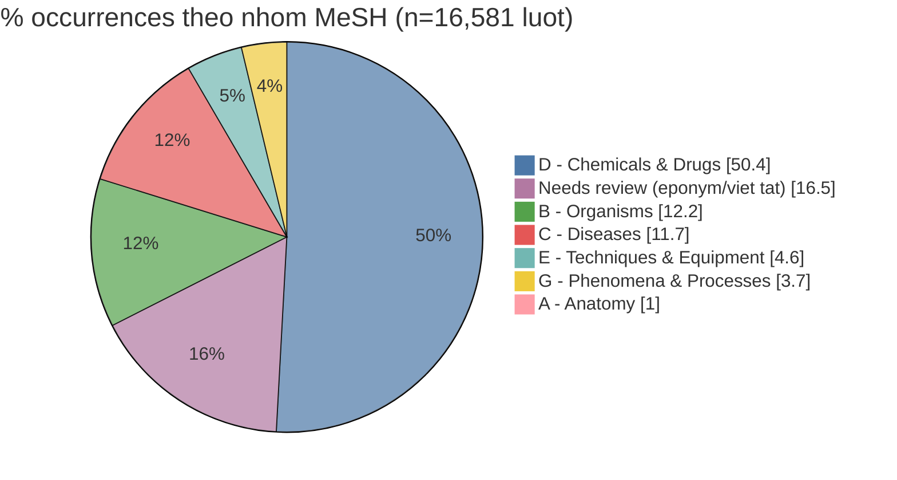

# ViMedCSS — Tập hợp & phân nhóm domain thuật ngữ + So sánh với thuật ngữ y khoa phổ biến

> 📋 **Tóm tắt phạm vi.** Báo cáo trả lời 3 việc trên dataset **ViMedCSS**: (1) tập hợp thuật ngữ y tế code-switch, (2) phân nhóm domain, (3) so sánh với khung thuật ngữ y khoa phổ biến. **Mọi con số đều trích trực tiếp từ metadata 4 split** (15,818 segment) hoặc từ nguồn học thuật công khai. Dataset đối chiếu **chỉ gồm dataset y tế tiếng Việt** đã kiểm chứng được nguồn.

## 0. Báo cáo có đáp ứng câu hỏi không?

| Tiêu chí (từ đề bài) | Mức đáp ứng | Xem mục |
|---|---|---|
| 1. Tập hợp thuật ngữ y tế trong ViMedCSS | ✅ Đủ — 889 term distinct + tần suất, đã xuất file | Mục 1 |
| 2. Phân nhóm domain thuật ngữ | ✅ Đủ — 5 topic của dataset + ánh xạ MeSH A–N (heuristic, có cờ tin cậy) | Mục 2 |
| 3. So sánh với thuật ngữ y khoa phổ biến | 🟡 Một phần — so theo nhóm MeSH và theo khung phân loại của các dataset VN khác; *overlap chính xác cần UMLS/MeSH API* (xem Hạn chế) | Mục 2.2 & 4 |

## 1. Tập hợp thuật ngữ — số liệu kiểm chứng

### 1.1. Tổng quan ViMedCSS

ViMedCSS là dataset **tiếng nói y tế code-switching Việt–Anh** (LREC 2026): câu tiếng Việt có xen ít nhất một thuật ngữ y khoa tiếng Anh, thu từ YouTube, phủ 5 chủ đề y khoa.

| Chỉ số | Giá trị (metadata 4 split) | Ghi chú |
|---|---|---|
| Tổng segment | 15,818 | Bản công khai (paper nêu 16,576 utt cho bản full) |
| Tổng thời lượng | 32.64 h | Paper nêu 34.57h cho bản full |
| Train / Validation / Test / Hard | 11,832 / 1,714 / 1,614 / 658 segment | 24.30 / 3.57 / 3.39 / 1.38 h |
| Tổng lượt xuất hiện CS (occurrences) | 16,581 | ✅ Khớp dataset card |
| **Số thuật ngữ CS distinct** | **889** | ✅ Khớp tuyệt đối |
| Video nguồn distinct | 2,588 | — |

### 1.2. 889 thuật ngữ + phân bố tần suất

Phân bố **long-tailed**: nhiều term hiếm, ít term phổ biến.

| Nhóm tần suất | Số term | Tỷ lệ |
|---|---|---|
| Hapax (xuất hiện đúng 1 lần) | 160 | 18.0% |
| ≤ 5 lần | 434 | 48.8% |
| ≥ 20 lần (phổ biến) | 208 | 23.4% |

**Top 15 term:** virus (946), gen (450), oxy (431), colagen (356), vitamin (341), glucose (297), inulin (238), hormone (232), lipid (210), corticoid (188), candida (177), vaccin (171), gram (163), lupus (144), caffein (134).

## 2. Phân nhóm domain thuật ngữ

### 2.1. Theo 5 topic của dataset

Nhãn `topic` có sẵn trong metadata, phân ViMedCSS thành 5 domain:

| Topic (domain) | Rows (đoạn câu) | Duration (thời lượng) | CS occurrences (số lần xuất hiện) |
|---|---|---|---|
| Medical Sciences | 6,836 | 14.68 | 7,459 |
| Pathology & Pathogens | 4,827 | 10.00 | 4,951 |
| Treatments | 1,969 | 3.80 | 1,985 |
| Nutrition | 1,155 | 2.14 | 1,155 |
| Diagnostics | 1,031 | 2.02 | 1,031 |

### 2.2. Ánh xạ nhóm MeSH A–N (đối chiếu khung y khoa chuẩn)

> ℹ️ Gán nhãn bằng **heuristic rule-based** (curated keyword + hậu tố hình thái), KHÔNG dùng UMLS/MeSH API (sandbox offline). Cột `mesh_confidence`: ≥90 = curated (191 term), 60–70 = suy theo hậu tố (244 term); còn lại gắn *needs review*.

| MeSH | Nhóm | Số term | % occurrences |
|---|---|---|---|
| D | Chemicals & Drugs | 313 | 50.4% |
| B | Organisms | 47 | 12.2% |
| C | Diseases | 56 | 11.7% |
| E | Techniques & Equipment | 11 | 4.6% |
| G | Phenomena & Processes | 5 | 3.7% |
| A | Anatomy | 3 | 1.0% |
| — | Needs review (eponym / viết tắt) | 454 | 16.5% |

**Nhận định (đã định lượng):** nhóm **D – Chemicals & Drugs áp đảo về occurrences (50.4%)**; Organisms (B) + Diseases (C) cộng lại ~24%. Có **454 term (51.1%) chưa map tự động** — hỗn hợp gồm eponym (Virchow, Henle, Golgi, Schwann, Langerhans, Pasteur…), viết tắt (B12, B6, LDL, CD4…) và thuật ngữ hoá–sinh chuyên biệt (interferon, phospholipid, ribosom, urat…). *Tỷ lệ chính xác giữa các nhóm chưa được định lượng — cần UMLS/MeSH API để chốt.*

## 3. Đặc điểm code-switch (từ `segment_text`)

| Chỉ số | Giá trị |
|---|---|
| Độ dài segment trung bình | 26.4 token (median 25, max 115) |
| Thời lượng segment trung bình | 7.43 s (3–29 s) |
| Mật độ CS (term / token) | 0.051 (~1 từ tiếng Anh / 20 từ) |
| CS term tối đa / segment | 4 (trung bình 1.05) |
| Segment có ≥1 CS term | 100% (CS-only theo thiết kế) |

**Vị trí term trong câu:** 1/3 đầu **39%** · giữa **29%** · 1/3 cuối **32%** → code-switching **intra-sentential** (xen kẽ trong câu), trải đều, hơi nghiêng đầu câu.

## 4. So sánh với các dataset y tế tiếng Việt khác

### 4.1. Nhóm tiếng nói (Speech / ASR)

| Dataset | Venue | Quy mô | Khung phân loại |
|---|---|---|---|
| **ViMedCSS** | LREC 2026 | 16,576 utt · 889 CS term distinct | 5 topic + nhãn CS mức từ |
| **VietMed** | LREC-COLING 2024 | 16h labeled + 1000h + 1200h unlabeled | Phủ toàn bộ nhóm bệnh ICD-10 |
| **MultiMed** | ACL 2025 | ASR y khoa 5 ngôn ngữ (có VI) | Theo ngôn ngữ + điều kiện thu |
| **VietMed-NER** | (thuộc MultiMed) | Spoken NER y khoa | 18 loại entity |

### 4.2. Nhóm văn bản (NER / QA / MT / NLI)

| Dataset | Venue | Task · Quy mô | Khung phân loại |
|---|---|---|---|
| **MedEV** | LREC-COLING 2024 | Dịch máy VI–EN · ~360K cặp câu | Domain y khoa (song ngữ) |
| **ViMQ** | ICONIP 2021 | NER + Intent · câu hỏi bệnh nhân | Entity: triệu chứng / bệnh / thủ thuật |
| **ViMedNER** | EAI 2024 | Medical NER · 8,000+ mẫu | Entity bệnh/thuốc, expert-annotated |
| **PhoNER_COVID19** | NAACL 2021 | NER · 10K câu / 35K entity | 10 loại entity COVID-19 |
| **ViHealthQA** | KSEM 2022 | QA · 10,015 cặp Q–A | Theo chủ đề sức khoẻ |
| **ViMedAQA** | ACL SRW 2024 | Abstractive QA | 4 chủ đề: bộ phận cơ thể / bệnh / thuốc / dược |
| **ViHealthNLI** | SIGUL 2024 | NLI y tế | Chủ đề: covid, bệnh viện, vaccine… |
| **VMHQA** | EAI 2025 | Multi-choice QA | Domain sức khoẻ tâm thần |

> 🧩 **Khác biệt khung phân loại:**
> (1) chuẩn bệnh quốc tế ICD-10 (VietMed);
> (2) topic tự định nghĩa ở mức chủ đề (ViMedCSS);
> (3) sơ đồ entity NER — triệu chứng/bệnh/thủ thuật (ViMQ), 10 entity COVID (PhoNER_COVID19);
> (4) theo chuyên khoa hẹp (VMHQA – tâm thần). ViMedCSS là **bộ duy nhất** tập trung vào **thuật ngữ code-switch Việt–Anh ở mức từ**.
