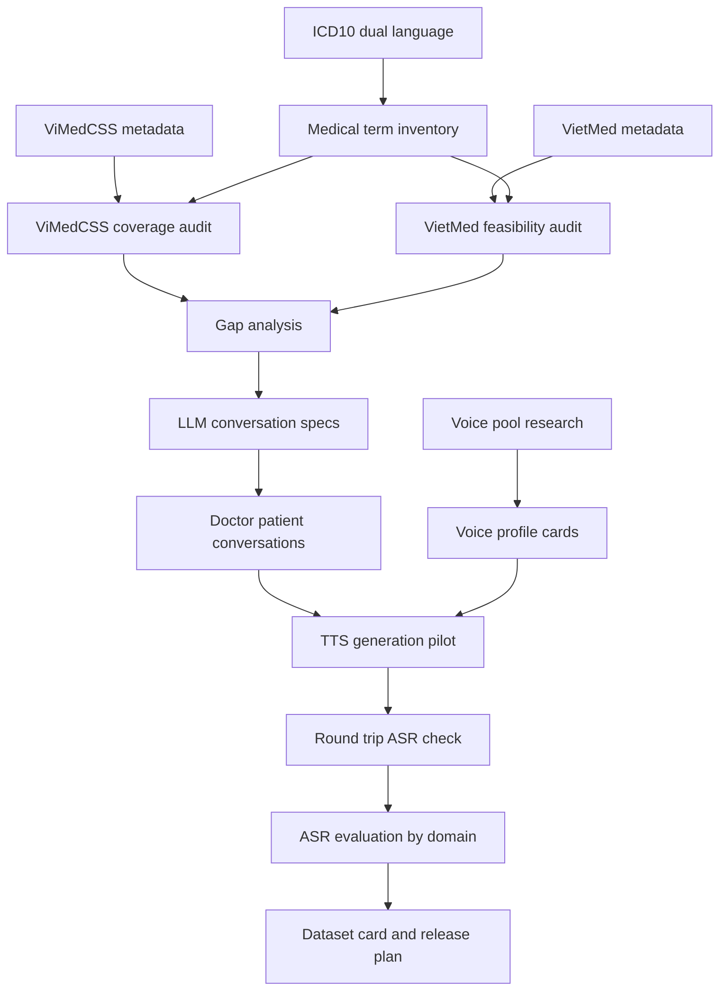

# PRD — VietMedVoice Phase 2 Enhancement

**Project:** VietMedVoice-CS  
**Phase:** Phase 2 — ICD-10 Grounded Coverage, Conversation Generation, Voice Pool, TTS Augmentation, ASR & Diarization Evaluation  
**Version:** v1.1  
**Date:** 2026-06-19  
**Document type:** Product Requirements Document / Research Engineering PRD  
**Language:** Vietnamese  

---

## 1. Tóm tắt mục tiêu

Phase 1 mới tập trung vào việc đánh giá ViMedCSS và thiết kế pipeline kiểm chứng coverage/code-switching. Phase 2 cần mở rộng dự án thành một hệ thống tạo và đánh giá dữ liệu y tế tiếng Việt có nền tảng rõ ràng hơn.

Mục tiêu chính của Phase 2:

1. Không chỉ đánh giá ViMedCSS, mà phải xây được **medical term inventory** dựa trên ICD-10 song ngữ Anh/Việt và các nhóm thuật ngữ y tế bổ sung.
2. Kiểm tra ViMedCSS đang cover được bao nhiêu thuật ngữ thuộc ICD-10 và các nhóm thuật ngữ y tế quan trọng.
3. Nghiên cứu khả năng dùng thêm VietMed hoặc các nguồn public hợp lệ để mở rộng dữ liệu real medical ASR.
4. Dùng LLM để sinh hội thoại bác sĩ - bệnh nhân có kiểm soát theo bệnh, triệu chứng, xét nghiệm, thuốc, thủ thuật và code-switching.
5. Đưa hội thoại qua TTS để tạo synthetic speech, ưu tiên model local có khả năng đọc tiếng Việt lẫn term tiếng Anh.
6. Xây voice pool theo giới tính, độ tuổi, vùng miền nếu metadata có bằng chứng; không tự suy đoán nếu dataset không công bố.
7. Tạo nền tảng để public dataset lớn hơn ViMedCSS, nhưng chỉ public khi license, privacy và ethics cho phép.

---

## 2. Bối cảnh và vấn đề cần giải quyết

ViMedCSS là dataset quan trọng cho Vietnamese medical code-switching ASR, nhưng Phase 2 không nên dừng ở việc đánh giá dataset này. Team cần biết rõ:

- ViMedCSS cover những bệnh/domain ICD-10 nào?
- Các thuật ngữ code-switching trong ViMedCSS thuộc nhóm nào: bệnh, thuốc, xét nghiệm, hormone, biomarker, thủ thuật, viết tắt, thiết bị, hay nhóm khác?
- So với danh sách thuật ngữ y tế phổ biến, ViMedCSS còn thiếu gì?
- Những term còn thiếu có thể được bổ sung bằng cách crawl real speech, sinh hội thoại bằng LLM, hay tạo audio bằng TTS không?
- TTS local hiện có đọc được tiếng Anh trong câu tiếng Việt đủ tốt không?
- Cần voice pool như thế nào để synthetic speech không quá đơn điệu?

Điểm quan trọng: **ICD-10 chủ yếu là hệ phân loại bệnh**, không bao phủ đầy đủ thuốc, xét nghiệm, thủ thuật, liều lượng, đơn vị, hormone, biomarker hoặc tên thiết bị. Vì vậy Phase 2 phải dùng ICD-10 làm backbone cho disease taxonomy, sau đó bổ sung thêm các lexicon khác cho non-disease medical terms.

---

## 3. Phạm vi Phase 2

### 3.1 In scope

Phase 2 bao gồm:

1. ICD-10 dual-language ingestion: lấy mã bệnh, nhãn tiếng Anh, nhãn tiếng Việt, chapter, section, type, disease.
2. ViMedCSS coverage audit: đo mức độ cover của ViMedCSS đối với ICD-10 và các nhóm thuật ngữ y tế.
3. VietMed feasibility audit: kiểm tra có thể dùng VietMed để bổ sung real medical ASR hay không.
4. Medical term taxonomy: disease, drug, lab test, procedure, anatomy, symptom, abbreviation, hormone, biomarker, pathogen, device, unit, dosage.
5. LLM conversation generation: sinh hội thoại bác sĩ - bệnh nhân theo schema có kiểm soát.
6. TTS model research: so sánh local/API model, chất lượng đọc tiếng Việt + term tiếng Anh, chi phí tạo dữ liệu.
7. Voice pool research: nguồn giọng, metadata giới tính/độ tuổi/vùng miền, license, cách chọn voice.
8. Synthetic TTS pilot: tạo audio thử nghiệm từ hội thoại đã validate.
9. ASR evaluation: đo WER/CER/CS-WER/Medical-Term Recall theo domain/entity.
10. **TV3 — ASR & Diarization:** dựng eval harness cho WER/CER và DER/JER theo lát cắt vùng/giới/chuyên khoa; chạy zero-shot PhoWhisper; fine-tune PhoWhisper-Small bằng synthetic + trộn VietMed; dùng pyannote 3.1 + WhisperX cho diarization/word-level speaker assignment.
11. Dataset packaging: chuẩn bị metadata, manifest, report và dataset card draft.

### 3.2 Out of scope

Phase 2 không bao gồm:

1. Chẩn đoán y tế thật hoặc tạo medical advice cho người dùng cuối.
2. Voice cloning từ bác sĩ/bệnh nhân thật nếu chưa có consent.
3. Public raw audio từ YouTube/TikTok/VietMed/viVoice nếu license không cho phép.
4. Claim rằng dataset cover toàn bộ ICD-10 nếu chưa chạy coverage audit có số liệu.
5. Fine-tune ASR production-scale nếu chưa hoàn tất data validation.
6. Tự suy đoán tuổi, giới tính, vùng miền của speaker khi không có metadata hoặc chưa có kiểm chứng.

---

## 4. Người dùng / Stakeholder

| Nhóm | Nhu cầu |
|---|---|
| Research lead | Cần biết dataset hiện tại thiếu gì và hướng novelty có đủ mạnh không. |
| Data engineer | Cần yêu cầu rõ để crawl/ingest dữ liệu, chuẩn hóa schema và lưu artifact. |
| LLM engineer | Cần schema để sinh hội thoại y tế có kiểm soát, không sinh lung tung. |
| TTS engineer | Cần đầu vào text/role/voice rõ để tạo synthetic speech. |
| ASR engineer | Cần manifest chuẩn để chạy model và tính metric. |
| QA/reviewer | Cần review queue, checklist và tiêu chí reject rõ ràng. |
| Publication owner | Cần dataset card, license report, privacy report và reproducibility notes. |

---

## 5. Source input cần có

### 5.1 Dataset và nguồn chính

| Input | Vai trò | Ghi chú |
|---|---|---|
| ViMedCSS | Baseline medical code-switching ASR dataset | Dùng để audit coverage và benchmark ASR. |
| ICD-10 dual-language KCB | Disease taxonomy Anh/Việt | Dùng để tạo disease inventory và map coverage. |
| VietMed | Nguồn real Vietnamese medical ASR tiềm năng | Cần kiểm tra license/access trước khi reuse. |
| viVoice | Nguồn nghiên cứu voice pool/TTS-oriented Vietnamese speech | Không tự suy đoán metadata nếu không có bằng chứng. |
| Meddict hoặc lexicon y tế khác | Medical bilingual term inventory | Cần kiểm tra license. |
| Drug/lab/procedure lists | Bổ sung ngoài ICD-10 | Vì ICD-10 không đủ cho thuốc/xét nghiệm/thủ thuật. |

### 5.2 ICD-10 endpoint requirement

Hệ thống cần hỗ trợ ingest ICD-10 song ngữ từ endpoint dạng:

```text
/api/ICD10/search/<query>?lang=vi|en&vol1=1&vol3=0&html=true
```

Yêu cầu xử lý:

1. Query theo mã ICD-10, ưu tiên code search thay vì Vietnamese free-text search.
2. Lấy cả `lang=en` và `lang=vi`, sau đó join theo `code`.
3. Parse JSON response, lấy field `html`, parse HTML tree để lấy `chapter`, `section`, `type`, `disease`.
4. Lưu parent-child relationship giữa chapter/section/type/disease.
5. Có retry, delay và error log vì endpoint reverse-engineered, chưa có official SLA.

---

## 6. Product goals và success metrics

### 6.1 Goals

| Goal ID | Goal | Success metric |
|---|---|---|
| G1 | Tạo ICD-10 dual-language inventory | Có `icd10_dual_language.jsonl/csv`, join EN/VI theo code, có chapter/section/type/disease. |
| G2 | Audit ViMedCSS coverage | Có report ViMedCSS cover bao nhiêu ICD disease terms, bao nhiêu non-ICD medical CS terms. |
| G3 | Xây medical taxonomy | Mỗi term có entity type, medical domain, confidence, source và review status. |
| G4 | Tạo conversation dataset bằng LLM | Có hội thoại bác sĩ - bệnh nhân theo ICD/domain/entity, có validation và human-review queue. |
| G5 | Chọn TTS strategy | Có bảng model, local/API, chi phí, hỗ trợ EN term, chất lượng, hạn chế. |
| G6 | Xây voice pool metadata | Có voice pool inventory với gender/age/region nếu có bằng chứng. |
| G7 | Tạo synthetic speech pilot | Có TTS manifest, audio path, transcript, voice profile, synthetic speaker id. |
| G8 | Đánh giá ASR theo domain/entity | Có WER/CER/CS-WER/Term Recall theo split/domain/entity. |
| G9 | Chuẩn bị public dataset | Có dataset card draft, license report, privacy report, release plan. |
| G10 | TV3 ASR & diarization evaluation | Có eval harness WER/CER/DER/JER, zero-shot baseline, fine-tune result, validation trên VietMed-test audio thật. |

### 6.2 Non-goals

| Non-goal | Lý do |
|---|---|
| Sinh dữ liệu không kiểm chứng | Dễ tạo dataset rác, không có giá trị research. |
| Claim coverage toàn ICD-10 | Chỉ được claim sau khi có số liệu local verified. |
| Dùng LLM output làm ground truth tuyệt đối | LLM có thể phân loại sai term y tế. |
| Public audio không rõ license | Rủi ro pháp lý và đạo đức. |
| Voice cloning người thật | Cần consent và policy riêng. |

---

## 7. Functional requirements

### FR1 — ICD-10 dual-language ingestion

**Mục tiêu:** tạo disease backbone song ngữ Anh/Việt.

**Input:**

- ICD-10 query codes.
- Endpoint KCB ICD-10.
- Config: `lang=en`, `lang=vi`, `vol1=1`, `vol3=0`, `html=true`.

**Process:**

1. Generate list mã ICD-10 cần query.
2. Query EN và VI.
3. Parse JSON/HTML.
4. Join theo code.
5. Normalize label.
6. Lưu hierarchy.

**Output:**

- `data/icd10/icd10_dual_language.jsonl`
- `data/icd10/icd10_dual_language.csv`
- `data/icd10/icd10_ingestion_errors.csv`
- `reports/icd10_ingestion_report.md`

**Acceptance criteria:**

- Mỗi record phải có `code`, `level`, `label_en`, `label_vi`, `parent_code`, `chapter_code`, `source_url`, `fetched_at`.
- Không được merge EN/VI bằng label text; chỉ join bằng code.
- Có log cho code thất bại hoặc response failure.

---

### FR2 — Medical term inventory mở rộng

**Mục tiêu:** tạo inventory không chỉ gồm ICD-10 disease terms mà còn gồm thuốc, xét nghiệm, thủ thuật, viết tắt, đơn vị.

**Input:**

- ICD-10 dual-language inventory.
- ViMedCSS `cs_terms_list`.
- External lexicon hợp lệ: Meddict, drug list, lab test list, procedure list, abbreviation list.

**Process:**

1. Extract unique terms.
2. Normalize term.
3. Deduplicate.
4. Classify theo `entity_type` và `medical_domain`.
5. Gắn source provenance.
6. Flag term cần human review.

**Output:**

- `data/terms/medical_term_inventory.csv`
- `data/terms/term_sources.csv`
- `data/terms/term_normalization_map.csv`
- `data/terms/human_review_terms.csv`

**Acceptance criteria:**

- Mỗi term phải có source.
- Không được tự tạo term không có nguồn, trừ nhóm `llm_generated_candidate` và phải flag `not_verified`.
- ICD-10 disease term phải tách khỏi drug/lab/procedure term.

---

### FR3 — ViMedCSS coverage audit

**Mục tiêu:** trả lời chính xác câu hỏi: ViMedCSS cover được bao nhiêu ICD-10 và bao nhiêu term y tế ngoài ICD-10.

**Input:**

- ViMedCSS metadata.
- `cs_terms_list`.
- `segment_text`.
- `topic`, `split`, `duration` nếu có.
- Medical term inventory.

**Process:**

1. Extract unique CS terms từ ViMedCSS.
2. Match với ICD-10 inventory.
3. Match với non-ICD inventory.
4. Group theo domain/entity/split/topic.
5. Tính coverage rate.
6. Lấy ví dụ câu thật cho từng domain/entity.

**Output:**

- `reports/vimedcss_coverage_report_vi.md`
- `data/coverage/vimedcss_icd10_coverage.csv`
- `data/coverage/vimedcss_non_icd_coverage.csv`
- `data/coverage/vimedcss_domain_coverage_matrix.csv`
- `data/coverage/vimedcss_missing_terms.csv`
- `data/coverage/vimedcss_hard_terms.csv`

**Acceptance criteria:**

- Report phải có số lượng, tỷ lệ, ví dụ term và ví dụ câu.
- Mọi số liệu phải lấy từ local verified files, không copy mù từ paper/HF card.
- Phải tách rõ: `paper_reported`, `hf_reported`, `local_verified` nếu các nguồn không khớp.

---

### FR4 — VietMed feasibility audit

**Mục tiêu:** đánh giá VietMed có thể dùng để mở rộng real medical ASR không.

**Input:**

- VietMed dataset page / metadata / license.
- Paper VietMed nếu có.
- Available splits/audio/transcripts.

**Process:**

1. Kiểm tra access.
2. Kiểm tra license.
3. Kiểm tra audio/transcript fields.
4. Kiểm tra có metadata ICD-10/domain/accent/speaker không.
5. So sánh overlap với ViMedCSS và ICD-10 inventory.

**Output:**

- `reports/vietmed_feasibility_report.md`
- `data/coverage/vietmed_icd10_coverage.csv`
- `data/coverage/vietmed_vs_vimedcss_overlap.csv`

**Acceptance criteria:**

- Không crawl/download nếu license không rõ.
- Nếu chỉ dùng được metadata thì report phải ghi rõ.
- Không claim VietMed có code-switching nếu chưa kiểm chứng bằng transcript.

---

### FR5 — LLM doctor-patient conversation generation

**Mục tiêu:** tạo hội thoại bác sĩ - bệnh nhân theo bệnh/domain/term, ưu tiên tự nhiên, có kiểm soát, dùng được làm TTS input.

**Input:**

- ICD-10 disease record.
- Medical term inventory.
- Conversation template.
- Role config: doctor, patient, optional nurse/pharmacist.
- Difficulty level.
- Code-switching level.
- Safety policy.

**Process:**

1. Select ICD disease/domain.
2. Select required terms.
3. Generate conversation bằng LLM.
4. Validate JSON schema.
5. Validate medical term inclusion.
6. Check no diagnosis advice outside intended synthetic context.
7. Human review sample.

**Output:**

- `data/conversations/conversation_specs.jsonl`
- `data/conversations/doctor_patient_conversations.jsonl`
- `data/conversations/conversation_validation_errors.jsonl`
- `reports/conversation_generation_report.md`

**Required JSON schema:**

```json
{
  "conversation_id": "conv_000001",
  "icd10_code": "I10",
  "domain": "cardiology",
  "scenario_type": "first_visit",
  "code_switch_level": "medium",
  "required_terms": ["hypertension", "blood pressure"],
  "turns": [
    {
      "turn_id": 1,
      "speaker_role": "doctor",
      "text": "Chào anh, hôm nay huyết áp của anh có ổn định không?",
      "medical_terms": ["huyết áp"],
      "language_mix": "vi"
    }
  ],
  "safety_flags": [],
  "generation_model": "gpt-5-mini",
  "prompt_version": "v1"
}
```

**Acceptance criteria:**

- Không sinh hội thoại plain text tự do; bắt buộc JSONL.
- Mỗi conversation phải trace được về ICD/domain/term source.
- Mỗi turn phải có speaker role.
- Mỗi conversation phải có `safety_flags` dù rỗng.
- Không được dùng conversation synthetic làm final real test set.

---

### FR6 — LLM cost and model analysis

**Mục tiêu:** xác định model nào dùng để tạo conversation và chi phí trên mỗi conversation.

**Input:**

- Candidate LLM models.
- Pricing.
- Prompt length.
- Output length.
- Retry rate assumption.

**Process:**

1. Benchmark 3-5 model nếu có thể.
2. Tính chi phí ước lượng/conversation.
3. Đánh giá JSON validity rate.
4. Đánh giá medical consistency.
5. Đánh giá khả năng follow schema.

**Output:**

- `reports/llm_model_cost_report.md`
- `data/model_eval/llm_generation_benchmark.csv`

**Acceptance criteria:**

- Có cost formula rõ ràng.
- Có giả định token rõ ràng.
- Có phân biệt cost text generation, TTS cost, ASR validation cost.
- Nếu cần API key thì ghi rõ key nào, dùng cho module nào, quyền gì.

---

### FR7 — TTS model research

**Mục tiêu:** chọn model TTS có thể đọc hội thoại tiếng Việt và term tiếng Anh/medical code-switching.

**Input:**

- Candidate local TTS models.
- Candidate API TTS models.
- Sample conversations.
- Term test list: drug/lab/disease/abbreviation.

**Process:**

1. Test đọc tiếng Việt thường.
2. Test đọc English medical terms trong câu tiếng Việt.
3. Test abbreviation: MRI, CT, ECG, HbA1c, eGFR.
4. Test thuốc: metformin, amoxicillin, corticosteroid.
5. Test giọng nam/nữ/vùng miền nếu model hỗ trợ.
6. Round-trip ASR check.
7. Human MOS hoặc simple rating.

**Output:**

- `reports/tts_model_research_report.md`
- `data/model_eval/tts_model_comparison.csv`
- `data/model_eval/tts_term_pronunciation_test.csv`

**Acceptance criteria:**

- Bảng model phải có: local/API, license, GPU requirement, Vietnamese quality, English term quality, voice control, cost, limitation.
- Ưu tiên local model nếu chất lượng đủ dùng.
- Nếu local không đọc được English term tốt, phải đề xuất fallback API.

---

### FR8 — Voice pool research

**Mục tiêu:** tạo pool giọng nói có metadata phục vụ TTS/synthetic speech diversity.

**Input:**

- viVoice hoặc dataset TTS/speech khác.
- Metadata nếu có: speaker/channel/gender/region/age.
- License.

**Process:**

1. Kiểm tra dataset có metadata gì thật.
2. Không suy đoán speaker attribute nếu không có bằng chứng.
3. Nếu cần estimate gender/age/region bằng model, phải gắn `estimated_*` và confidence.
4. Chọn voice profile cho synthetic TTS.
5. Đảm bảo mỗi synthetic voice có `synthetic_speaker_id`.

**Output:**

- `data/voice_pool/voice_pool_inventory.csv`
- `data/voice_pool/voice_profile_cards.jsonl`
- `reports/voice_pool_research_report.md`

**Acceptance criteria:**

- Mỗi voice profile phải có source/license.
- Gender/age/region phải có status: `provided`, `estimated`, `unknown`.
- Không dùng real identity/name nếu không cần thiết.
- Không public voice/audio nếu license không cho phép.

---

### FR9 — Synthetic TTS generation pilot

**Mục tiêu:** tạo synthetic speech pilot từ conversation đã validate.

**Input:**

- `doctor_patient_conversations.jsonl`
- `voice_profile_cards.jsonl`
- Selected TTS model.

**Process:**

1. Split conversation turns.
2. Assign voice theo role.
3. Generate audio per turn hoặc full conversation.
4. Store audio path.
5. Run round-trip ASR.
6. Check term preservation.
7. Flag failed pronunciation.

**Output:**

- `data/synthetic_tts/synthetic_tts_manifest.jsonl`
- `data/synthetic_tts/roundtrip_asr_check.jsonl`
- `reports/synthetic_tts_quality_report.md`

**Acceptance criteria:**

- Mỗi audio phải trace được về conversation, turn, term, voice, TTS model.
- Synthetic data chỉ dùng train/augmentation, không dùng final real test.
- Failed pronunciation phải được log, không âm thầm giữ lại.

---

### FR10 — ASR evaluation after enhancement

**Mục tiêu:** đánh giá ASR không chỉ theo WER/CER, mà theo domain/entity/term.

**Input:**

- Real ASR manifest.
- Synthetic TTS manifest.
- Ground truth transcript.
- Term/domain/entity labels.
- ASR prediction.

**Process:**

1. Run baseline ASR.
2. Compute WER/CER.
3. Compute CS-WER or term-level recall.
4. Group metrics by domain/entity/split.
5. Compare real-only vs synthetic-augmented if training is included.

**Output:**

- `data/asr/asr_predictions.jsonl`
- `data/asr/asr_metrics_by_domain.csv`
- `data/asr/asr_term_error_analysis.csv`
- `reports/asr_evaluation_report.md`

**Acceptance criteria:**

- Report phải trả lời: model sai nhiều ở domain/entity nào.
- Có top failed terms.
- Có hard/rare term analysis.
- Không claim improvement nếu chưa có controlled experiment.


---

### FR11 — TV3 ASR & Diarization Evaluation Harness

**Mục tiêu:** dựng một evaluation harness có thể kiểm chứng liệu dữ liệu synthetic bác sĩ - bệnh nhân có giúp cải thiện ASR/diarization trên audio y tế thật hay không. Đây là module đánh giá cốt lõi cho next phase, không chỉ là script chạy model.

**Research grounding:**

- PhoWhisper là họ model ASR tiếng Việt gồm nhiều kích cỡ; bản repo VinAI liệt kê `vinai/PhoWhisper-small` có 244M parameters và báo cáo WER trên các benchmark tiếng Việt. PhoWhisper được fine-tune từ Whisper trên 844 giờ dữ liệu có đa dạng accent tiếng Việt.
- `pyannote/speaker-diarization-3.1` yêu cầu `pyannote.audio >= 3.1`, cần accept model conditions trên Hugging Face, nhận audio mono 16kHz và xuất diarization annotation/RTTM.
- WhisperX hỗ trợ ASR nhanh, word-level timestamps, alignment bằng wav2vec2 và speaker diarization để gán speaker label ở mức từ.
- `pyannote.metrics` hỗ trợ đánh giá diarization có thể tái lập; DER được định nghĩa theo false alarm, missed detection và confusion trên tổng thời lượng reference speech; JER là metric bổ sung dựa trên Jaccard, cân bằng hơn giữa các speaker.

**Input bắt buộc:**

| Input | File/nguồn | Mục đích |
|---|---|---|
| Real test audio | `data/vietmed/test_audio/` hoặc manifest tương đương | Là tập kiểm chứng thật, không dùng synthetic làm final test. |
| Ground truth transcript | `data/vietmed/vietmed_test_manifest.jsonl` | Tính WER/CER và term-level ASR metrics. |
| Optional diarization reference | `data/vietmed/diarization_reference.rttm` hoặc `*.jsonl` | Tính DER/JER nếu có reference speaker turns. Nếu không có, chỉ được báo diarization qualitative/proxy, không claim DER/JER. |
| Synthetic train manifest | `data/synthetic_tts/synthetic_tts_manifest.jsonl` | Dùng để fine-tune PhoWhisper-Small hoặc augmentation experiment. |
| VietMed train/dev manifest | `data/vietmed/train_manifest.jsonl`, `data/vietmed/dev_manifest.jsonl` | Dùng để trộn real medical ASR với synthetic. |
| Metadata slice labels | gender, age_bucket, region, specialty, domain, entity_type | Dùng group metric theo lát cắt. Nếu metadata thiếu thì ghi `unknown`. |

**Process:**

1. **Build eval manifest**
   - Tạo một manifest thống nhất cho ASR và diarization.
   - Mỗi audio segment phải có `audio_path`, `transcript`, `split`, `source`, `duration`, `domain`, `specialty`, `gender`, `age_bucket`, `region`, `speaker_count` nếu có.
   - Không tự suy đoán gender/age/region; nếu không có bằng chứng thì ghi `unknown`.

2. **Zero-shot ASR baseline**
   - Chạy PhoWhisper zero-shot trên VietMed-test hoặc tập test audio thật được duyệt.
   - Model ưu tiên: PhoWhisper-Small để cân bằng chi phí và khả năng fine-tune; có thể thêm PhoWhisper-Base/Large làm baseline tham chiếu nếu đủ tài nguyên.
   - Output phải lưu nguyên prediction, không ghi đè transcript gốc.

3. **Fine-tune PhoWhisper-Small**
   - Thực nghiệm tối thiểu:
     - E0: zero-shot PhoWhisper-Small.
     - E1: fine-tune với synthetic only.
     - E2: fine-tune với VietMed real train only, nếu license/access cho phép.
     - E3: fine-tune với VietMed real + synthetic.
   - Final validation bắt buộc chạy trên VietMed-test hoặc real medical test audio, không dùng synthetic test để claim improvement.

4. **ASR metrics**
   - Tính WER/CER chung.
   - Tính WER/CER theo slice: `region`, `gender`, `age_bucket`, `specialty`, `domain`, `entity_type`.
   - Tính medical term metrics nếu có term labels: CS-Term Recall, Medical-Term Recall, Drug/Lab/Disease/Procedure Recall, number/unit error nếu dữ liệu có label.
   - Report phải nêu confidence hoặc số lượng mẫu trên mỗi slice; slice quá ít mẫu không được dùng để kết luận mạnh.

5. **Diarization baseline**
   - Chạy pyannote 3.1 để sinh speaker turns và lưu RTTM.
   - Nếu biết trước số speaker trong audio doctor-patient, cho phép truyền `num_speakers=2`; nếu không biết thì chạy open-speaker diarization và log config.
   - Audio input cần normalize về mono/16kHz hoặc kiểm tra rằng tool tự resample/downmix đúng.

6. **WhisperX alignment và speaker-attributed transcript**
   - Dùng WhisperX để tạo word-level timestamps.
   - Kết hợp output pyannote speaker turns với word timestamps để gán `speaker_id` cho từng word/utterance.
   - Output dùng để phân tích hội thoại bác sĩ - bệnh nhân, speaker turn, overlap/error, không được dùng làm ground truth nếu chưa human review.

7. **Diarization metrics**
   - Nếu có reference RTTM: tính DER/JER bằng pyannote.metrics.
   - Nếu không có reference RTTM: chỉ report speaker count accuracy proxy, turn statistics hoặc qualitative samples; không được claim DER/JER.
   - DER/JER cần report theo slice nếu mỗi slice đủ số mẫu.

8. **Ablation và validation**
   - Mục tiêu chính là chứng minh synthetic augmentation có giúp trên audio thật không.
   - So sánh E0/E1/E2/E3 theo cùng test set.
   - Improvement phải ghi absolute và relative change, ví dụ WER giảm từ X xuống Y; nếu không cải thiện phải ghi rõ.

**Output bắt buộc:**

| Output | Lưu gì |
|---|---|
| `data/eval/eval_manifest.jsonl` | Audio path, transcript, source, split, domain/entity/slice labels. |
| `data/asr/phowhisper_zero_shot_predictions.jsonl` | Prediction của zero-shot PhoWhisper. |
| `data/asr/phowhisper_finetune_runs.jsonl` | Metadata từng lần fine-tune: train data, hyperparams chính, model checkpoint, run id. |
| `data/asr/asr_predictions_by_run.jsonl` | Prediction theo từng run E0/E1/E2/E3. |
| `reports/asr_metrics_overall.csv` | WER/CER tổng theo model/run. |
| `reports/asr_metrics_by_slice.csv` | WER/CER/term metrics theo region/gender/age/specialty/domain/entity. |
| `reports/asr_synthetic_ablation_report.md` | Kết luận synthetic có cải thiện hay không trên real test. |
| `data/diarization/pyannote_predictions.rttm` | Output speaker turns từ pyannote 3.1. |
| `data/diarization/whisperx_word_speakers.jsonl` | Word-level timestamps + speaker label theo từ. |
| `reports/diarization_metrics.csv` | DER/JER nếu có reference; nếu không có thì file phải ghi `not_available_reason`. |
| `reports/tv3_final_report.md` | Report tổng hợp ASR + diarization + ablation + giới hạn. |

**Acceptance criteria:**

- Có ít nhất một zero-shot ASR baseline chạy trên real test audio.
- Có ít nhất một fine-tune run PhoWhisper-Small trên synthetic hoặc synthetic + VietMed nếu dữ liệu cho phép.
- Có bảng so sánh E0/E1/E2/E3 trên cùng real test set.
- Có metric theo lát cắt vùng/giới/chuyên khoa nếu metadata có thật; nếu thiếu metadata, report phải ghi rõ không đánh giá được slice đó.
- DER/JER chỉ được báo khi có reference diarization. Nếu không có reference, không được claim diarization accuracy.
- Mọi checkpoint/output phải trace được về train manifest và config.
- Không được claim synthetic giúp cải thiện nếu improvement không xuất hiện trên real test.

**Gating conditions trước khi bắt đầu fine-tune:**

1. VietMed access/license đã được QA/Ethics duyệt.
2. Synthetic manifest đã pass pronunciation/round-trip ASR check ở mức tối thiểu.
3. Eval manifest có transcript thật và split cố định.
4. Baseline zero-shot đã chạy xong và lưu prediction.
5. Có run config versioning để tái lập kết quả.


---

## 8. Data schema requirements

### 8.1 ICD-10 dual language record

```json
{
  "code": "I10",
  "level": "type",
  "label_en": "Essential hypertension",
  "label_vi": "Tăng huyết áp nguyên phát",
  "chapter_code": "IX",
  "chapter_label_en": "Diseases of the circulatory system",
  "chapter_label_vi": "Bệnh của hệ tuần hoàn",
  "parent_code": "I00-I99",
  "source": "kcb_icd10_tt06",
  "source_url": "https://...",
  "fetched_at": "2026-06-19T00:00:00+07:00"
}
```

### 8.2 Medical term inventory record

```json
{
  "term_id": "term_000001",
  "term_original": "HbA1c",
  "term_normalized": "hba1c",
  "entity_type": "lab_test",
  "medical_domain": "endocrinology",
  "source": "manual_lab_test_list",
  "icd10_code": null,
  "is_code_switch_candidate": true,
  "review_status": "verified"
}
```

### 8.3 ViMedCSS coverage record

```json
{
  "term": "metformin",
  "matched_inventory_term": "metformin",
  "entity_type": "drug",
  "medical_domain": "endocrinology",
  "icd10_match": false,
  "non_icd_match": true,
  "occurrence_count": 12,
  "splits": ["train", "test"],
  "topics": ["endocrinology"],
  "example_segment_id": "...",
  "example_sentence": "..."
}
```

### 8.4 Voice profile record

```json
{
  "voice_id": "voice_0001",
  "source_dataset": "viVoice",
  "speaker_id": "anonymous_or_dataset_id",
  "gender_status": "provided_or_estimated_or_unknown",
  "gender": "female",
  "age_status": "unknown",
  "age_bucket": null,
  "region_status": "estimated",
  "region": "southern",
  "license": "...",
  "allowed_use": "research_only",
  "notes": "No real identity stored"
}
```

### 8.5 Synthetic TTS manifest record

```json
{
  "synthetic_id": "syn_000001",
  "conversation_id": "conv_000001",
  "turn_id": 1,
  "speaker_role": "doctor",
  "voice_id": "voice_0001",
  "synthetic_speaker_id": "syn_spk_0001",
  "text": "Chào anh, hôm nay huyết áp của anh có ổn định không?",
  "audio_path": "audio/synthetic/syn_000001.wav",
  "tts_model": "local_tts_model_name",
  "medical_terms": ["huyết áp"],
  "quality_status": "pending_roundtrip_check"
}
```

---

## 9. Pipeline tổng thể Phase 2



---

## 10. Folder structure yêu cầu

```text
vietmedvoice-phase2/
  README.md
  configs/
    icd10_ingestion.yaml
    term_taxonomy.yaml
    llm_generation.yaml
    tts_models.yaml
    asr_eval.yaml
  data/
    raw/
      vimedcss/
      vietmed/
      icd10/
    icd10/
      icd10_dual_language.jsonl
      icd10_dual_language.csv
      icd10_ingestion_errors.csv
    terms/
      medical_term_inventory.csv
      term_sources.csv
      term_normalization_map.csv
      human_review_terms.csv
    coverage/
      vimedcss_icd10_coverage.csv
      vimedcss_non_icd_coverage.csv
      vimedcss_domain_coverage_matrix.csv
      vimedcss_missing_terms.csv
      vimedcss_hard_terms.csv
      vietmed_icd10_coverage.csv
      vietmed_vs_vimedcss_overlap.csv
    conversations/
      conversation_specs.jsonl
      doctor_patient_conversations.jsonl
      conversation_validation_errors.jsonl
    voice_pool/
      voice_pool_inventory.csv
      voice_profile_cards.jsonl
    synthetic_tts/
      synthetic_tts_manifest.jsonl
      roundtrip_asr_check.jsonl
    asr/
      asr_predictions.jsonl
      asr_metrics_by_domain.csv
      asr_term_error_analysis.csv
    model_eval/
      llm_generation_benchmark.csv
      tts_model_comparison.csv
      tts_term_pronunciation_test.csv
  reports/
    icd10_ingestion_report.md
    vimedcss_coverage_report_vi.md
    vietmed_feasibility_report.md
    llm_model_cost_report.md
    conversation_generation_report.md
    tts_model_research_report.md
    voice_pool_research_report.md
    synthetic_tts_quality_report.md
    asr_evaluation_report.md
    dataset_card_draft.md
    phase2_final_report_vi.md
  src/
    icd10_ingestion/
    term_inventory/
    coverage_audit/
    llm_generation/
    voice_pool/
    tts_generation/
    asr_evaluation/
    diarization_evaluation/
    model_training/
    reporting/
  tests/
```

---

## 11. Vai trò team đề xuất

| Role | Trách nhiệm chính | Output chính |
|---|---|---|
| Research Lead / PM | Chốt scope, title, research question, review final report. | PRD, timeline, final decision. |
| Data Engineer 1 | ICD-10 ingestion, HF interaction, folder/schema. | ICD-10 dual CSV/JSONL, ingestion report. |
| Data Analyst 1 | ViMedCSS/VietMed coverage audit. | Coverage matrix, gap analysis. |
| Medical Term Reviewer | Review taxonomy, term/entity/domain labels. | Verified term inventory, review queue. |
| LLM Engineer | Prompt/schema cho doctor-patient conversation. | Conversation generator, validation report. |
| TTS Engineer | Test local/API TTS, pronunciation, cost. | TTS model report, synthetic manifest. |
| Voice/Data Researcher | Nghiên cứu voice pool theo gender/age/region/license. | Voice pool inventory, voice profile cards. |
| ASR/Diarization Engineer | Chạy ASR baseline, fine-tune PhoWhisper-Small, tính WER/CER, chạy pyannote/WhisperX và tính DER/JER khi có reference. | ASR metrics, diarization metrics, error analysis. |
| QA/Ethics Owner | License, PHI/PII, public release policy. | License report, privacy checklist, dataset card. |

---

## 12. Timeline đề xuất

### Tuần 1 — ICD-10 và taxonomy foundation

| Task | Owner | Output |
|---|---|---|
| Ingest ICD-10 EN/VI | Data Engineer | `icd10_dual_language.csv/jsonl` |
| Chốt entity schema | Research Lead + Reviewer | `term_taxonomy.yaml` |
| Chuẩn bị term inventory v0 | Data Analyst | `medical_term_inventory.csv` |

### Tuần 2 — ViMedCSS coverage audit

| Task | Owner | Output |
|---|---|---|
| Extract CS terms từ ViMedCSS | Data Analyst | `cs_terms_inventory.csv` |
| Map ViMedCSS với ICD-10 | Data Analyst | `vimedcss_icd10_coverage.csv` |
| Map non-ICD terms | Reviewer | `vimedcss_non_icd_coverage.csv` |
| Viết coverage report | Research Lead | `vimedcss_coverage_report_vi.md` |

### Tuần 3 — VietMed feasibility và source expansion

| Task | Owner | Output |
|---|---|---|
| Kiểm tra VietMed access/license | QA/Ethics | `vietmed_feasibility_report.md` |
| So sánh VietMed vs ViMedCSS | Data Analyst | `vietmed_vs_vimedcss_overlap.csv` |
| Chốt sources được dùng | PM + QA | `source_approval_matrix.csv` |

### Tuần 4 — LLM conversation generation

| Task | Owner | Output |
|---|---|---|
| Thiết kế prompt/schema | LLM Engineer | `conversation_specs.jsonl` |
| Sinh pilot conversations | LLM Engineer | `doctor_patient_conversations.jsonl` |
| Validate JSON + medical terms | Data Analyst | `conversation_validation_errors.jsonl` |
| Review sample | Medical Reviewer | `human_review_conversations.csv` |

### Tuần 5 — TTS và voice pool

| Task | Owner | Output |
|---|---|---|
| Nghiên cứu TTS model | TTS Engineer | `tts_model_research_report.md` |
| Nghiên cứu voice pool | Voice Researcher | `voice_pool_inventory.csv` |
| Tạo synthetic pilot | TTS Engineer | `synthetic_tts_manifest.jsonl` |
| Round-trip ASR check | ASR Engineer | `roundtrip_asr_check.jsonl` |

### Tuần 6 — ASR evaluation và release draft

| Task | Owner | Output |
|---|---|---|
| ASR metric theo domain/entity | ASR Engineer | `asr_metrics_by_domain.csv` |
| Error analysis | ASR Engineer + Reviewer | `asr_term_error_analysis.csv` |
| Final report | Research Lead | `phase2_final_report_vi.md` |
| Dataset card draft | QA/Ethics + PM | `dataset_card_draft.md` |


### Tuần 7 — TV3 ASR fine-tuning và diarization harness

| Task | Owner | Output |
|---|---|---|
| Build eval manifest cho VietMed-test | ASR/Diarization Engineer | `eval_manifest.jsonl` |
| Chạy zero-shot PhoWhisper-Small | ASR/Diarization Engineer | `phowhisper_zero_shot_predictions.jsonl` |
| Fine-tune PhoWhisper-Small với synthetic | ASR/Diarization Engineer | `phowhisper_finetune_runs.jsonl` |
| Fine-tune PhoWhisper-Small với synthetic + VietMed nếu được duyệt | ASR/Diarization Engineer + QA | `asr_predictions_by_run.jsonl` |
| Chạy pyannote 3.1 baseline | ASR/Diarization Engineer | `pyannote_predictions.rttm` |
| Chạy WhisperX alignment + speaker assignment | ASR/Diarization Engineer | `whisperx_word_speakers.jsonl` |

### Tuần 8 — TV3 validation và ablation report

| Task | Owner | Output |
|---|---|---|
| Tính WER/CER theo run và slice | ASR/Diarization Engineer | `asr_metrics_by_slice.csv` |
| Tính DER/JER nếu có reference RTTM | ASR/Diarization Engineer | `diarization_metrics.csv` |
| So sánh E0/E1/E2/E3 | Research Lead + ASR Engineer | `asr_synthetic_ablation_report.md` |
| Viết TV3 report | Research Lead | `tv3_final_report.md` |

---

## 13. Milestones

| Milestone | Điều kiện hoàn thành |
|---|---|
| M1 — ICD-10 Backbone Ready | Có ICD-10 EN/VI inventory, parse được hierarchy và có ingestion report. |
| M2 — ViMedCSS Coverage Known | Có số liệu ViMedCSS cover/không cover ICD-10 và non-ICD terms. |
| M3 — Term Gap Defined | Có danh sách missing/high-priority terms cho data generation. |
| M4 — Conversation Pilot Ready | Có hội thoại bác sĩ - bệnh nhân JSONL hợp lệ, review được. |
| M5 — TTS/Voice Strategy Ready | Có model recommendation, cost, voice pool và synthetic pilot. |
| M6 — ASR Evaluation Ready | Có metric theo domain/entity và report lỗi term. |
| M7 — Public Dataset Draft Ready | Có dataset card, license/privacy notes, release plan. |
| M8 — TV3 ASR/Diarization Validated | Có zero-shot baseline, fine-tune result, WER/CER by slice, pyannote/WhisperX output, DER/JER nếu có reference. |

---

## 14. Rủi ro và cách giảm rủi ro

| Rủi ro | Tác động | Mitigation |
|---|---|---|
| ICD-10 endpoint thay đổi | Không ingest được | Cache raw responses, log version, có fallback manual source. |
| Vietnamese keyword search fail | Missing disease terms | Ưu tiên code search, join EN/VI theo code. |
| LLM sinh medical text sai | Dataset nhiễu | JSON validation, term validation, human review sample. |
| TTS đọc sai English terms | Synthetic audio kém | Round-trip ASR + pronunciation test + human rating. |
| Voice metadata không rõ | Không xây được age/region pool chuẩn | Dùng `unknown` hoặc `estimated` có confidence, không bịa. |
| License không cho public | Không public được dataset đầy đủ | Publish metadata/code/report; raw audio chỉ public nếu license cho phép. |
| Dataset synthetic quá nhiều | ASR overfit synthetic style | Final test real-only, ablation real-only vs real+TTS. |
| Không có diarization reference | Không tính được DER/JER | Chỉ báo qualitative/proxy, hoặc tạo human-labeled RTTM subset. |
| pyannote model cần gated access | Pipeline diarization không chạy được | Chuẩn bị HF token, accept model conditions, có fallback skip diarization. |
| WhisperX alignment sai với audio y tế/code-switch | Speaker-word assignment nhiễu | Review sample, so sánh với transcript/timestamps, không dùng làm ground truth nếu chưa kiểm chứng. |
| Synthetic không cải thiện VietMed-test | Hypothesis không được chứng minh | Báo trung thực no-improvement, phân tích error và điều chỉnh TTS/term coverage. |
| Team ôm quá rộng | Không ra output | Chốt milestone 6 tuần, ưu tiên coverage + pilot trước. |

---

## 15. Yêu cầu về tính trung thực dữ liệu

1. Không được claim số liệu nếu chưa có file local verified.
2. Mọi output phải trace được về source.
3. LLM classification chỉ là machine-assisted label, không phải ground truth tuyệt đối.
4. Term không chắc phải đưa vào human review queue.
5. Speaker metadata không có thì ghi `unknown`, không suy đoán.
6. Synthetic speech phải ghi rõ `synthetic`, không trộn với real speech.
7. Final ASR test set phải real-only nếu mục tiêu là đo thực tế.
8. Report phải phân biệt: `source_reported`, `paper_reported`, `hf_reported`, `local_verified`.

---

## 16. Open questions cần team chốt

| Câu hỏi | Người chốt | Deadline đề xuất |
|---|---|---|
| Phase 2 target tạo bao nhiêu conversation pilot? | PM + Research Lead | Tuần 1 |
| Có dùng VietMed raw audio không hay chỉ audit metadata? | QA/Ethics + Data Engineer | Tuần 3 |
| External drug/lab/procedure list nào hợp lệ license? | Reviewer + QA | Tuần 2 |
| TTS ưu tiên local model nào? | TTS Engineer | Tuần 5 |
| Có cần mua API key cho LLM/TTS/ASR không? | PM | Tuần 4 |
| Human review sampling rate bao nhiêu? | Research Lead | Tuần 4 |
| Dataset public theo license nào? | QA/Ethics | Tuần 6 |
| VietMed-test có diarization reference không? Nếu không, ai label subset? | Research Lead + QA | Tuần 7 |
| Fine-tune PhoWhisper-Small chạy local/GPU nào và budget bao nhiêu? | ASR Engineer + PM | Tuần 7 |
| Slice vùng/giới/tuổi có metadata thật không hay phải để unknown? | Voice Researcher + QA | Tuần 7 |

---

## 17. Suggested project title

### Option A — Ngắn gọn, research-oriented

```text
VietMedVoice-CS: ICD-10 Grounded Vietnamese Medical Code-Switching Speech Dataset
```

### Option B — Nhấn mạnh synthetic augmentation

```text
VietMedVoice-CS: ICD-10 Grounded Doctor-Patient Speech Generation for Vietnamese Medical Code-Switching ASR
```

### Option C — Nhấn mạnh public dataset

```text
VietMedVoice-CS: A Public Vietnamese Medical Code-Switching Speech Corpus with ICD-10 Grounded Synthetic Dialogue Augmentation
```

**Khuyến nghị:** dùng Option B cho giai đoạn research/paper, dùng Option C nếu dataset public thật sự được release.

---

## 18. Definition of Done cho Phase 2

Phase 2 được xem là hoàn thành khi có đủ:

1. ICD-10 dual-language inventory.
2. Medical term inventory mở rộng.
3. ViMedCSS ICD-10/non-ICD coverage report.
4. VietMed feasibility report.
5. LLM conversation generation pipeline và pilot output.
6. TTS model/cost report.
7. Voice pool inventory.
8. Synthetic TTS pilot manifest.
9. ASR evaluation by domain/entity.
10. TV3 ASR/diarization harness: zero-shot PhoWhisper, fine-tune PhoWhisper-Small, pyannote/WhisperX output, WER/CER/DER/JER report theo điều kiện dữ liệu.
11. Final Vietnamese report.
11. Dataset card draft và release plan.

---

## 19. Ghi chú triển khai

PRD này không yêu cầu cố định OS, dependency hoặc framework cụ thể. Mỗi coding agent có thể chọn stack phù hợp, nhưng bắt buộc tuân thủ:

- Input/output file contract.
- Folder structure.
- JSONL/CSV schemas.
- Source provenance.
- Audit log.
- Không bịa số liệu.
- Không public dữ liệu khi license chưa rõ.

